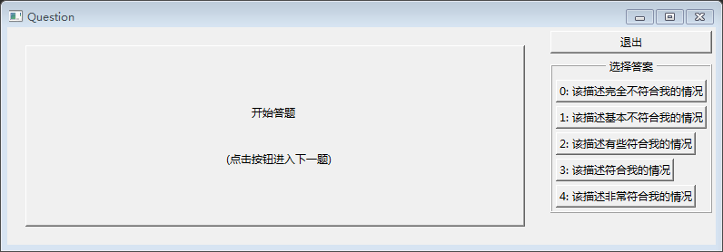
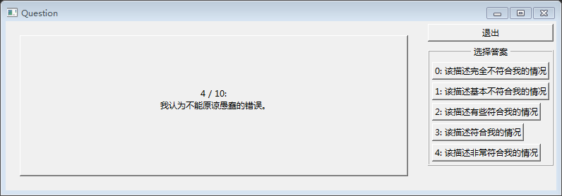

# Quiz Desktop

- - -

Quiz Desktop 使用

- - -

###### 安装依赖组件

    $ bundle

###### 运行

    $ ruby quiz.rb

###### 打包可执行文件 （使用 ocra）

    $ make quiz.rb

###### 注意事项

每次开发前先更新服务器上的代码

    $ git pull

每次修改完本地的代码后，提交自己的代码

    $ git add .                          # 添加所有的修改
    $ git commit -m 'xxx'                # 提交本次修改和附上说明文字
    $ git push origin master             # 推送代码到 github 服务器